# chock-claude-plugins

Chock policies packaged as installable plugins, in Claude Code's plugin format.



**This repository is generated.** Every file is compiled from policy sources in
[chock-catalog](https://github.com/open-coder-ai/chock-catalog) by
[chock](https://github.com/open-coder-ai/chock). Pull requests here are closed with a
pointer to the catalog — review belongs where the source is.

## Which clients this works with

The Claude plugin format is read natively by **Claude Code, GitHub Copilot CLI, VS Code,
and Grok Build**. The repository is named for the format, not for a single client — if you
use any of those four, this is for you.

```bash
# Claude Code
/plugin marketplace add open-coder-ai/chock-claude-plugins
/plugin install block-destructive-commands@chock
```

Using a different agent? Each vendor has its own repo built from the same catalog,
carrying that client's native format and deny dialect:
[chock-copilot-plugins](https://github.com/open-coder-ai/chock-copilot-plugins)
(Copilot CLI / VS Code, spec-shaped),
[chock-cursor-plugins](https://github.com/open-coder-ai/chock-cursor-plugins) and
[chock-codex-plugins](https://github.com/open-coder-ai/chock-codex-plugins).
Clients that read the Agent Plugins 1.0 standard can use the `agent-plugins/` tree
(advisory: the standard carries no hooks).

## What a plugin actually does — read this before installing

Chock's rule is that a claim must match a mechanism. That rule applies to these packages,
so the plugins are not equally strong and they say so.

See **[PLUGINS.md](PLUGINS.md)** for the full list: every policy, its version, whether it
enforces or advises in this client, and a link to its page in the catalog. That file is
generated from the packages themselves, so it cannot drift from what is published.

Hook behaviour on Windows (the python3 requirement, fail-open vs fail-closed clients) is
stated per plugin in [PLUGINS.md](PLUGINS.md).

**A plugin is not the same as adopting Chock.** A plugin governs one person's session on
one client. It cannot enforce anything at commit time, it does not travel with a clone,
and it does not run in CI. Repository-wide enforcement — git hooks and a CI gate that a
`--no-verify` cannot skip — comes from installing Chock in the repo:

```bash
pip install chock
chock init && chock sync --ci
```

## Layout

```
claude/<policy-id>/          Claude-format packages (hooks where the policy has a guard)
agent-plugins/<policy-id>/   Agent Plugins 1.0 packages (advisory: the standard has no hooks)
.claude-plugin/marketplace.json    the index Claude Code, VS Code and Grok read
.github/plugin/marketplace.json    byte-identical copy, the path Copilot CLI reads
```

The two trees are deliberately separate. The same policy is enforced in a Claude package
that ships a hook, and advisory in an Agent Plugins package that cannot carry one — so a
shared skill file would have to make a claim that is false for one of them.

## Trust

- Generated only: CI regenerates from the pinned catalog and fails on any difference, so
  content here cannot be hand-edited into something the catalog never published.
- Guard scripts and the hook adapter are byte-identical copies of their sources in the
  framework — a plugin cannot quietly behave differently from a repository install.
- Guards are best-effort filters, not a security boundary. Aliases, quoting, and unusual
  paths can evade a pattern-based check. See
  [SECURITY.md](https://github.com/open-coder-ai/chock/blob/main/SECURITY.md) and the
  [assurance case](https://github.com/open-coder-ai/chock/blob/main/docs/assurance-case.md).

## License

Apache-2.0, same as the framework and the catalog.
